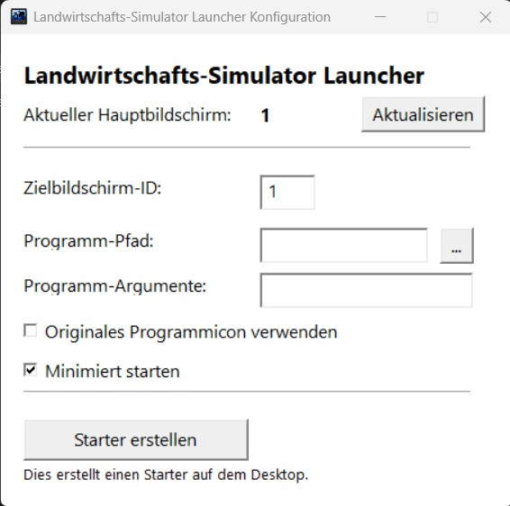

# LSScreenLauncher
**[English version below](#EN)**

Starte Landwirtschafts Simulator auf einem anderen Bildschirm, ohne Fenster zu verschieben!

LS startet immer auf dem Windows-Hauptmonitor. Dieses Tool ändert diese Einstellung auf einen konfigurierten Monitor (z.B. einen Fernseher), startet das Spiel, wartet bis es geschlossen wird und schaltet den Hauptmonitor zurück zur ursprünglichen Einstellung.

## Verwendung
Keine Installation erforderlich. Einfach die [neueste Version](https://github.com/techdiem/LSScreenLsuncher/releases/latest) in einen beliebigen Ordner herunterladen, das Programm öffnen und in der GUI konfigurieren.

**Wichtig:** Als Spielpfad darf aktuell nicht der Launcher verwendet werden, da dieser sich direkt wieder schließt. Es muss die game.exe gewählt werden. Hin und wieder sollte man den Launcher manuell öffnen um Update zu installieren.

Das Programm erstellt eine Verknüpfung auf dem Desktop zum Starten des Spiels. Wenn das Programm erneut geöffnet wird, liest es die vorhandene Verknüpfungskonfiguration, sodass man diese bearbeiten kann.

## Screenshot

---

### EN

Start Farming Simulator on a different screen without moving windows!

FS always launches on the windows primary monitor, so this tool sets this setting to a configured monitor (e.g. your tv), launches the game, waits for it to close and switch the primary monitor back to the original setting.

## Usage
No installation required, just download the latest release to some folder, start the program and configure it in the gui (gui language currently only german).

**Important:** You cannot use the game launcher as path, because that immediately exits. You need to choose the game.exe. You should then use the launcher manually from time to time to check for updates.

It will create a shortcut on your desktop to launch the game. When opening the program again, it reads the existing shortcut config so you can edit it.
